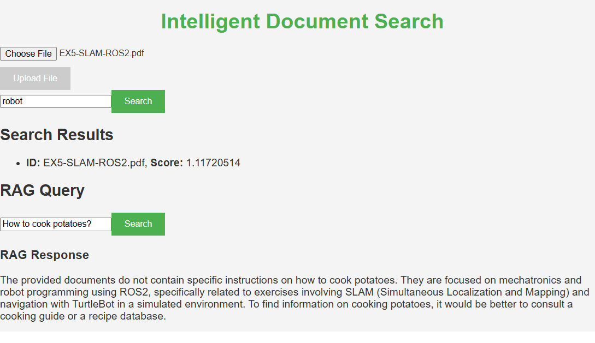
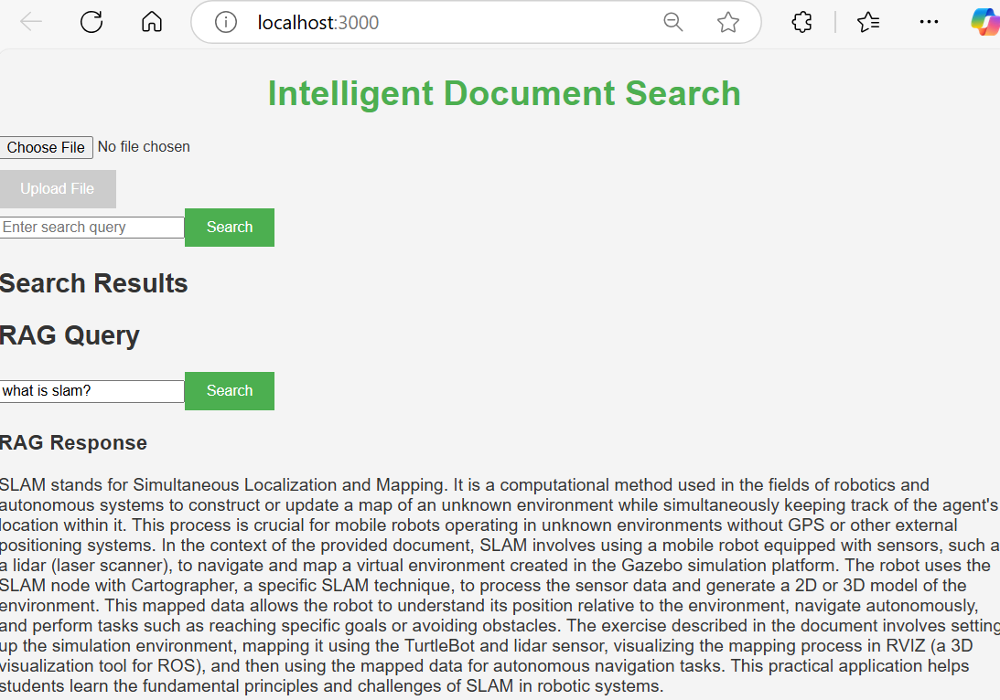

# Intelligent Document Search and Summarization Tool

<p align="center">
  
  
</p>

## Overview
The Intelligent Document Search and Retrieval Augmented Generation Tool is an AI-powered application designed to help users efficiently search and summarize content from various document formats, including PDFs, Word files, and plain text. By leveraging advanced language models and semantic search techniques, this tool enables users to extract insights quickly and effectively.

## Functionality
Upload documents in pdf, txt, doc formats, which are stored in the cloud vector Pinecore database and local SQL lite database. 

Search words and phrases within this databse to retrieve relevant documents.

Ask questions related to the content of the uploaded.  

## Features
- **AI-Driven Search**: Utilize large language models (LLMs) to interpret natural language queries and retrieve relevant document sections.
- **Interactive User Interface**: A user-friendly frontend built with React, allowing for document uploads and real-time query responses.
- **Semantic Search**: Implement a vector database for enhanced search accuracy and contextual relevance.
- **RAG**: Ask questions to LLM model augmented with the text retrieved from the document databases.  


## Project Structure
The project is organized into three main directories:
- **backend**: Contains the FastAPI application, including API routes, services for search and summarization, and utility functions for database interactions.
- **frontend**: Contains the React application, including components for file upload, query input, and results display.
- **docs**: Documentation detailing the architecture, AI pipelines, database integration, and performance metrics. This folder is temporary empty. 

```
intelligent-doc-search/ 
├── backend/         # Backend application code 
├── frontend/        # Frontend application code 
├── docs/            # Docs 
├── README.md        # Readme 
└── .gitignore       # gitignore file
```

## Getting Started

### Prerequisites
- Python 3.8 or higher
- Node.js and npm
- Docker (optional, for containerization)

### Installation

1. **Clone the repository**:
   ```
   git clone git@github.com:msilaev/IntelDocSearch.git
   cd intelligent-doc-search
   ```

2. **Backend Setup**:
   - Navigate to the `backend` directory:
     ```
     cd backend
     ```
   - Install the required Python packages:
     ```
     pip install -r requirements.txt
     ```

3. **Frontend Setup**:
   - Navigate to the `frontend` directory:
     ```
     cd frontend
     ```
   - Install the required Node packages:
     ```
     npm install
     ```

### Running the Application

1. **Start the Backend**:
   - In the `backend` directory, run:
     ```
     uvicorn app.main:app --reload
     ```

2. **Start the Frontend**:
   - In the `frontend` directory, run:
     ```
     npm start
     ```

3. **Access the Application**:
   - Open your web browser and navigate to `http://localhost:3000` to access the frontend.

## Extensions
Future enhancements may include:
- Voice-to-text capabilities for spoken queries
- Support for multi-language document processing
- A feedback loop to improve model performance based on user interactions

## License
This project is licensed under the MIT License. See the LICENSE file for more details.